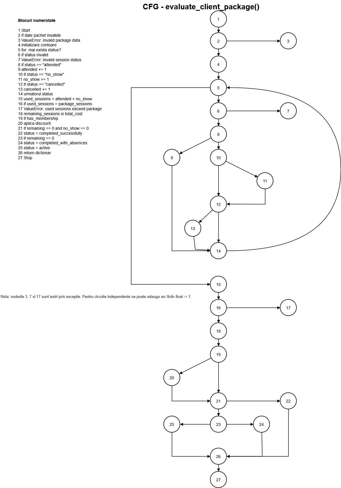
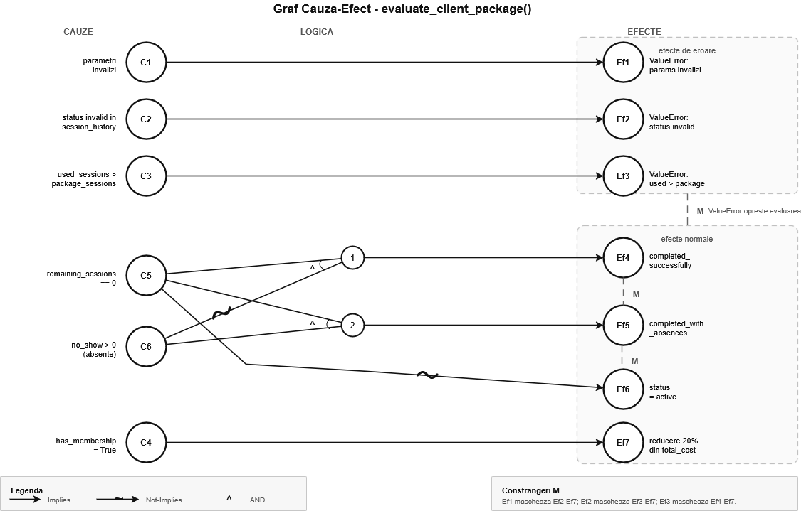

# TSS T1 - Testare unitară în Python

Lucrare realizată pentru disciplina **Testarea Sistemelor Software**, tema
**T1 - Testare unitară în Python**.

Clasa testată este `FitnessClassBooking`, care modelează evaluarea unui pachet
de ședințe pentru o clasă de fitness. Funcționalitatea principală analizată
este metoda:

```python
evaluate_client_package(session_history, package_sessions, has_membership)
```

## 1. Cerința proiectului

Conform temei T1, proiectul trebuie să folosească un framework de testare
unitară din Python și să ilustreze strategiile de generare a testelor discutate
la curs:

- partiționare în clase de echivalență;
- analiza valorilor de frontieră;
- acoperire la nivel de instrucțiune;
- acoperire la nivel de decizie;
- acoperire la nivel de condiție;
- circuite independente;
- analiză pe baza unui generator de mutanți;
- teste suplimentare pentru omorârea unor mutanți neechivalenți.

Pe lângă cod și teste, proiectul include documentație completă, diagrame
realizate cu tool dedicat, capturi de ecran cu rulările finale, comparații
între tool-uri și o secțiune despre utilizarea unui instrument AI.

## 2. Ideea aplicației

Domeniul ales este gestionarea ședințelor de fitness. Un client poate cumpăra
un pachet cu un număr fix de ședințe. La finalul fiecărei ședințe, statusul
este înregistrat: clientul a participat, nu s-a prezentat fără să anunțe,
sau a anulat în avans. Metoda `evaluate_client_package` calculează starea
curentă a pachetului pe baza acestui istoric.

Cele trei statusuri au efecte diferite asupra pachetului:

| Status | Semnificație | Consumă ședință? |
| --- | --- | --- |
| `attended` | clientul a participat la ședință | da |
| `no_show` | clientul nu s-a prezentat și nu a anunțat | da |
| `cancelled` | clientul a anulat la timp | nu |

Statusul final al pachetului poate fi:

- `active` — mai sunt ședințe disponibile;
- `completed_successfully` — pachetul s-a terminat fără nicio absență nemotivată;
- `completed_with_absences` — pachetul s-a terminat, dar a existat cel puțin
  un `no_show`.

## 3. Clasa testată

Fișier principal: `fitness_class_booking.py`

```python
class FitnessClassBooking:
    def __init__(
        self,
        class_name: str,
        instructor: str,
        price_per_session: float,
    ) -> None: ...

    def evaluate_client_package(
        self,
        session_history: list[str],
        package_sessions: int,
        has_membership: bool,
    ) -> dict: ...
```

Constructorul validează:

| Parametru | Regulă |
| --- | --- |
| `class_name` | trebuie să fie unul dintre `dance`, `pilates`, `yoga`, `zumba` |
| `instructor` | trebuie să fie șir nevid după aplicarea `strip()` |
| `price_per_session` | trebuie să fie număr pozitiv; valorile `bool` sunt respinse explicit |

Metoda `evaluate_client_package` validează:

| Parametru | Regulă |
| --- | --- |
| `session_history` | trebuie să fie listă |
| `package_sessions` | trebuie să fie `int` între `1` și `20`; valorile `bool` sunt respinse explicit |
| `has_membership` | trebuie să fie strict `bool` |
| fiecare status din istoric | trebuie să fie `attended`, `no_show` sau `cancelled` |
| ședințe consumate | nu pot depăși numărul de ședințe din pachet |

O particularitate importantă a implementării este că tipul `bool` este verificat
separat, înainte de orice verificare numerică. În Python, `bool` este subclasă
a lui `int`, deci valorile `True` și `False` ar trece prin validări numerice
(`True == 1`, `False == 0`) dacă nu sunt respinse explicit [4].

## 4. Exemplu de utilizare

```python
booking = FitnessClassBooking("yoga", "Ana Pop", 50)

result = booking.evaluate_client_package(
    ["attended", "attended", "cancelled", "no_show"],
    5,
    True,
)
```

Rezultatul este:

```python
{
    "attended": 2,
    "no_show": 1,
    "cancelled": 1,
    "used_sessions": 3,
    "remaining_sessions": 2,
    "total_cost": 200.0,
    "status": "active",
}
```

Explicație pas cu pas:

- `attended` și `no_show` consumă ședință, `cancelled` nu consumă → `used_sessions = 3`;
- din cele `5` ședințe ale pachetului rămân `2`;
- costul de bază este `5 × 50 = 250` — calculat pe pachetul întreg, nu pe
  ședințele folosite;
- clientul are membership, deci se aplică reducerea de `20%` → `250 × 0.8 = 200`;
- mai sunt ședințe disponibile, deci statusul este `active`.

## 5. Cerințe structurale acoperite de metodă

Metoda a fost aleasă astfel încât să conțină explicit elementele necesare
pentru testarea structurală cerută la curs:

| Cerință | Unde apare în cod |
| --- | --- |
| minimum 3 parametri | `session_history`, `package_sessions`, `has_membership` |
| instrucțiune repetitivă | `for session_status in session_history` |
| `if` cu `else` | `if session_status == "attended": ... else: ...` |
| `if` fără `else` | `if has_membership: ...` |
| condiție simplă | `if has_membership` |
| condiție compusă | `remaining_sessions == 0 and no_show == 0` |

## 6. Configurație hardware și software

| Componentă | Valoare |
| --- | --- |
| Laptop | HP Laptop 15s-fq2xxx |
| Memorie RAM | aproximativ 16 GB |
| Sistem de operare principal | Windows 11 Pro, 64-bit |
| Python pe Windows | Python 3.13.3 |
| Framework testare | pytest 9.0.3 [1] |
| Coverage | coverage.py 7.13.5 [2] |
| WSL pentru mutation testing | Ubuntu 24.04.1 LTS |
| Python în WSL | Python 3.12.3 |
| Mutmut în WSL | mutmut 2.5.1 [3] |

`mutmut` a fost rulat în WSL deoarece în mediul Windows curent nu funcționează
nativ. Testele obișnuite și coverage-ul au fost rulate pe Windows.

## 7. Strategii de testare

Suita principală are **100 de teste** organizate în cinci fișiere, câte unul
per strategie. Toate testele folosesc framework-ul `pytest` [1].

| Fișier | Strategie | Nr. teste |
| --- | --- | ---: |
| `test_equivalence_partitioning.py` | partiționare în clase de echivalență | 23 |
| `test_boundary_value_analysis.py` | valori de frontieră | 16 |
| `test_coverage.py` | acoperire instrucțiune / decizie / condiție | 40 |
| `test_independent_circuits.py` | circuite independente | 10 |
| `test_mutation.py` | teste orientate pe mutanți | 11 |

---

### 8.1 Partiționare în clase de echivalență

Partiționarea în clase de echivalență presupune împărțirea domeniului de intrare
în grupuri de valori care ar trebui să se comporte identic din perspectiva
codului testat. În loc să testezi toate valorile posibile, alegi câte un
reprezentant din fiecare clasă [5].

Pentru `FitnessClassBooking`, clasele au fost identificate separat pentru
constructor și pentru metoda principală.

**Constructorul** primește trei parametri, fiecare cu domeniu propriu:

*class_name* are două clase: valorile valide (`dance`, `pilates`, `yoga`,
`zumba`) și cele invalide. Clasa invalidă se divide la rândul ei după cauza
erorii: tip greșit (`123`, `None`) sau valoare corectă ca tip dar necunoscută
(`"boxing"`, `"spinning"`). Toate cele patru clase valide sunt testate explicit
— inclusiv `"zumba"`, care a fost adăugată după analiza de mutanți pentru a
asigura că mutațiile pe șirul de caractere `"zumba"` sunt detectate.

*instructor* are clasa validă (orice șir nevid după `strip()`) și două clase
invalide: tip greșit (`None`, `42`) și șir vid sau format doar din spații
(`""`, `"   "`). Șirul `"   "` este un caz special — înainte de aplicarea
`strip()` pare nevid, dar după devine `""`.

*price_per_session* are trei clase invalide distincte: tip `bool` (respins
explicit din cauza relației `bool`-`int` din Python), tip non-numeric
(`"50"`, `None`) și valoare numerică nepozitivă (`0`, `-10`). Clasa validă
este orice număr pozitiv non-bool.

**Metoda** `evaluate_client_package` introduce clase suplimentare:

*session_history*: clasa validă include lista goală și lista cu statusuri
corecte; clasa invalidă include orice non-listă (`"attended"`, `("a",)`).

*package_sessions*: intervalul `[1, 20]` formează clasa validă; în afara lui
există două clase invalide — sub limită (`0`, negative) și peste limită (`21`,
`25`). Separat, `bool` (`True`, `False`) formează o clasă invalidă proprie.

*has_membership*: clasa validă este `{True, False}`, iar clasa invalidă include
orice altceva — întregi (`1`, `0`), șiruri (`"yes"`), `None`.

*statusurile din istoric*: clasa validă este `{"attended", "no_show",
"cancelled"}`; orice alt șir sau orice valoare non-string formează clasa
invalidă.

*consumul față de pachet*: o clasă validă (consumat ≤ pachet) și o clasă
invalidă (consumat > pachet), care produce `ValueError`.

**Clasele de output** acoperă cele trei statusuri finale posibile: `active`,
`completed_successfully` și `completed_with_absences`.

Un exemplu reprezentativ pentru clasa validă mixtă, care verifică simultan
toate contoarele și discountul:

```python
def test_ep_valid_mixed_history_with_membership(self) -> None:
    result = self.booking.evaluate_client_package(
        ["attended", "no_show", "cancelled"], 5, True
    )
    self.assertEqual(result["attended"], 1)
    self.assertEqual(result["no_show"], 1)
    self.assertEqual(result["cancelled"], 1)
    self.assertEqual(result["used_sessions"], 2)
    self.assertEqual(result["remaining_sessions"], 3)
    self.assertEqual(result["total_cost"], 200.0)  # 5 × 50 × 0.80
    self.assertEqual(result["status"], "active")
```

---

### 8.2 Analiza valorilor de frontieră

Analiza valorilor de frontieră extinde partiționarea prin testarea valorilor
de la limita dintre clase valide și invalide. Erorile de implementare apar
frecvent exact la aceste limite — de exemplu, o condiție scrisă cu `<` în
loc de `<=` [5][6].

**Frontierele pentru `package_sessions`** sunt cele mai relevante, deoarece
intervalul valid `[1, 20]` are două capete clare. Valorile testate sunt:

| Valoare | Clasificare | Test |
| --- | --- | --- |
| `0` | sub limita minimă → invalid | `test_bva_package_sessions_zero_raises_value_error` |
| `1` | limita minimă → valid | `test_bva_package_sessions_one_is_valid` |
| `2` | min + 1 → valid | `test_bva_package_sessions_two_is_valid` |
| `19` | max - 1 → valid | `test_bva_package_sessions_nineteen_is_valid` |
| `20` | limita maximă → valid | `test_bva_package_sessions_twenty_is_valid` |
| `21` | peste limita maximă → invalid | `test_bva_package_sessions_twenty_one_raises_value_error` |

Testul pentru `package_sessions=20` verifică și costul rezultat (`20 × 50 = 1000`),
nu doar că valoarea este acceptată. Testul pentru `package_sessions=19`
verifică costul (`19 × 50 = 950`) și că rămân `18` ședințe după una consumată.

**Frontierele pentru `price_per_session`** vizează limita de la zero:

- `-0.01` → invalid (imediat sub zero);
- `0.0` → invalid (exact zero);
- `0.01` → valid (imediat deasupra zero).

**Frontierele pentru `instructor`** vizează lungimea șirului după `strip()`:

- `""` → invalid (șir gol);
- `"A"` → valid (un singur caracter).

**Frontiera de consum** este momentul în care `used_sessions` atinge sau
depășește `package_sessions`. Trei teste acoperă această zonă:

```python
# o ședință înainte de completare — pachet activ
result = self.booking.evaluate_client_package(["attended", "attended"], 3, False)
# remaining = 1, status = "active"

# consum exact fără no_show — completed_successfully
result = self.booking.evaluate_client_package(
    ["attended", "attended", "attended"], 3, False
)
# remaining = 0, no_show = 0, status = "completed_successfully"

# consum exact cu un no_show — completed_with_absences
result = self.booking.evaluate_client_package(
    ["attended", "attended", "no_show"], 3, False
)
# remaining = 0, no_show = 1, status = "completed_with_absences"
```

Și testul pentru depășire cu o ședință:

```python
# 4 ședințe consumate în pachet de 3 → ValueError
self.booking.evaluate_client_package(
    ["attended", "attended", "attended", "attended"], 3, False
)
```

---

### 8.3 Acoperire structurală

Acoperirea structurală urmărește execuția zonelor din codul sursă, nu a
cazurilor de business. Au fost aplicate trei niveluri, în ordinea crescătoare
a stricteții.

#### Acoperire la nivel de instrucțiune

La acest nivel se urmărește ca fiecare linie de cod să fie executată cel puțin
o dată. Rezultatul obținut este **100%** pe `fitness_class_booking.py`:

```text
Name                       Stmts   Miss Branch BrPart  Cover
-------------------------------------------------------------
fitness_class_booking.py      43      0     26      0   100%
```

Cele 43 de instrucțiuni din fișier sunt acoperite în întregime. Testele de la
nivelul de instrucțiune (`TestStatementCoverage` din `test_coverage.py`) au
fost proiectate să parcurgă fiecare bloc de cod al metodei: constructorul
valid, fiecare ramură invalidă, bucla, ramura `attended`, ramura `no_show`,
ramura `cancelled`, verificarea depășirii, calculul cu și fără membership,
fiecare status final.

#### Acoperire la nivel de decizie

Acoperirea la nivel de decizie este mai strictă: fiecare `if` din cod trebuie
să fie executat o dată pe ramura `True` și o dată pe ramura `False`. Există
șapte decizii principale în implementare, fiecare acoperită în ambele sensuri.

*Validarea parametrilor metodei* — condiție compusă cu `or`:

```python
if (
    not isinstance(session_history, list)      # True: "attended" → ValueError
    or isinstance(package_sessions, bool)      # True: True → ValueError
    or not isinstance(package_sessions, int)   # True: "5" → ValueError
    or package_sessions < 1                    # True: 0 → ValueError
    or package_sessions > self.MAX_PACKAGE_SESSIONS  # True: 21 → ValueError
    or not isinstance(has_membership, bool)    # True: "yes" → ValueError
):
    raise ValueError("invalid package data")
# Ramura False: [], 1, False → funcționează normal
```

*Validarea statusului în buclă*:
- True: `["unknown"]` → `ValueError("invalid session status")`
- False: `["cancelled"]` → statusul e procesat normal

*Ramura `attended`*:
- True: `["attended"]` → `attended += 1`
- False: `["no_show"]` sau `["cancelled"]` → intră în `else`

*Depășire pachet*: `if used_sessions > package_sessions`:
- True: `["attended", "attended"]` cu `package_sessions=1` → `ValueError`
- False: orice istoric valid → continuă calculul

*Discount membership*: `if has_membership`:
- True: `([], 2, True)` → `total_cost = 2 × 50 × 0.80 = 80.0`
- False: `([], 2, False)` → `total_cost = 2 × 50 = 100.0`

*Statusul final* (două decizii înlănțuite):
- `remaining == 0 and no_show == 0` → `completed_successfully`
- `remaining == 0` (cu `no_show > 0`) → `completed_with_absences`
- altfel → `active`

#### Acoperire la nivel de condiție

La acest nivel se verifică fiecare condiție atomică dintr-o expresie compusă
independent de celelalte. Scopul este să se demonstreze că niciuna dintre
condiții nu este redundantă sau mascată.

Condiția compusă cea mai relevantă este cea pentru statusul final:
`remaining_sessions == 0 and no_show == 0`. Aceasta are două condiții atomice,
care sunt testate pe toate combinațiile posibile:

| `remaining_sessions == 0` | `no_show == 0` | Status obținut |
| --- | --- | --- |
| True | True | `completed_successfully` |
| True | False | `completed_with_absences` |
| False | — (short-circuit) | `active` |

Pentru condiția de validare din constructor pentru `price_per_session`:

```python
if (
    isinstance(price_per_session, bool)                  # testat: True → ValueError
    or not isinstance(price_per_session, (int, float))   # testat: "50" → ValueError
    or price_per_session <= 0                            # testat: 0.0 → ValueError
):
```

Fiecare condiție atomică este acoperită separat printr-un test dedicat:
`test_cc_constructor_price_bool_true`, `test_cc_constructor_price_non_number_true`
și `test_bva_price_zero_raises_value_error`.

---

### 8.4 Circuite independente

Un circuit independent reprezintă un drum complet prin graful de control al
fluxului (CFG), de la intrarea în metodă până la ieșire. Două circuite sunt
independente dacă unul dintre ele parcurge cel puțin o muchie care nu apare
în niciunul dintre celelalte [5][6].

Metoda `evaluate_client_package` are nouă puncte de decizie principale:

| Decizie | Condiție |
| --- | --- |
| D1 | validarea parametrilor metodei |
| D2 | validarea fiecărui status din `session_history` |
| D3 | `session_status == "attended"` |
| D4 | `session_status == "no_show"` |
| D5 | `session_status == "cancelled"` |
| D6 | `used_sessions > package_sessions` |
| D7 | `has_membership` |
| D8 | `remaining_sessions == 0 and no_show == 0` |
| D9 | `remaining_sessions == 0` |

Din aceste nouă decizii au fost extrase zece circuite reprezentative:

| Cale | Descriere |
| --- | --- |
| Path 1 | D1 → True: parametri invalizi → excepție imediată |
| Path 2 | D1 → False, istoric gol, D6→F, D7→F, D8→F, D9→F: pachet activ |
| Path 3 | D1→F, D2→True: status invalid în buclă → excepție |
| Path 4 | D3→True: `attended` × 2, D6→F, D8→True: `completed_successfully` |
| Path 5 | D3→F, D4→True: `no_show`, D8→F, D9→True: `completed_with_absences` |
| Path 6 | D3→F, D5→True: `cancelled`, D6→F, D8→F, D9→F: pachet activ, 0 consumate |
| Path 7 | istoric mixt, D7→True: discount aplicat, pachet activ |
| Path 8 | D6→True: consum > pachet → excepție |
| Path 9 | `attended`, D7→True: membership, D8→F, D9→F: pachet activ |
| Path 10 | `attended` × 2, D7→True: membership, D8→True: `completed_successfully` |

Testul pentru Path 9 verifică explicit că discountul este calculat pe
pachetul complet, chiar dacă e parcurs un singur circuit:

```python
result = make_booking().evaluate_client_package(["attended"], 3, True)
self.assertEqual(result["total_cost"], 120.0)  # 3 × 50 × 0.80, nu 1 × 50 × 0.80
```

---

### 8.5 Mutation testing

Mutation testing-ul evaluează calitatea testelor prin introducerea automată
a unor modificări mici (mutanți) în codul sursă și verificarea dacă testele
detectează aceste modificări. Un mutant „ucis" înseamnă că cel puțin un test
a eșuat — semn că testele sunt suficient de precise. Un mutant „supraviețuitor"
ridică întrebarea dacă testele verifică suficient de specific comportamentul
respectiv [2][3].

Au fost folosite două instrumente complementare.

#### Mutmut

`mutmut` generează mutanți prin înlocuirea operatorilor, modificarea valorilor
numerice și a șirurilor de caractere, negarea condițiilor și eliminarea unor
expresii. Pe codul din `fitness_class_booking.py` a generat **95 de mutanți**.

Rezultat final:

```text
95/95 mutanți verificați
Killed:     85
Suspicious: 10
Survived:    0
Timeout:     0
Skipped:     0
```

Cei `10` mutanți clasificați ca `Suspicious` nu sunt echivalenți cu `Survived`.
Categoria `Suspicious` apare când rularea unui test ia mai mult decât pragul
de timp față de baseline, dar fără a depăși timeout-ul fatal. Rezultatul
important este `0 survived` — niciun mutant nu a trecut nedetectat.

#### Testele orientate pe mutanți — `test_mutation.py`

Analiza rapoartelor `mutmut` a arătat că anumite comportamente nu erau
verificate suficient de precis în suita inițială. Au fost adăugate 11 teste
dedicate pentru a omorî mutanții neechivalenți probabili.

**Costul calculat pe pachetul complet, nu pe ședințele folosite.** Un mutant
care ar înlocui `package_sessions` cu `used_sessions` în formula costului
nu ar fi detectat dacă testele nu verifică explicit diferența. Testul de mai
jos confirmă că un singur `attended` dintr-un pachet de `5` nu schimbă
costul total:

```python
def test_mutation_total_cost_uses_package_sessions_not_used_sessions(self) -> None:
    result = make_booking().evaluate_client_package(["attended"], 5, False)
    self.assertEqual(result["used_sessions"], 1)
    self.assertEqual(result["total_cost"], 250.0)  # 5×50, nu 1×50
```

**Discountul de exact 20%.** Un mutant care ar folosi `0.10` sau `0.30` în
loc de `MEMBERSHIP_DISCOUNT` trebuie detectat:

```python
def test_mutation_membership_discount_is_applied_to_whole_package(self) -> None:
    result = make_booking().evaluate_client_package([], 10, True)
    self.assertEqual(result["total_cost"], 400.0)  # 10×50×0.80
```

**`cancelled` nu consumă ședință.** Un mutant care ar incrementa `used_sessions`
și pentru `cancelled` ar fi detectat de:

```python
def test_mutation_cancelled_session_does_not_consume_package_session(self) -> None:
    result = make_booking().evaluate_client_package(["attended", "cancelled"], 2, False)
    self.assertEqual(result["used_sessions"], 1)
    self.assertEqual(result["remaining_sessions"], 1)
```

**`no_show` blochează `completed_successfully`.** Testul confirmă că un pachet
terminat cu `no_show` nu poate fi marcat drept finalizat cu succes:

```python
def test_mutation_no_show_consumes_session_and_prevents_clean_completion(self) -> None:
    result = make_booking().evaluate_client_package(["attended", "no_show"], 2, False)
    self.assertEqual(result["status"], "completed_with_absences")
    self.assertNotEqual(result["status"], "completed_successfully")
```

**Mesajele de eroare sunt stabile.** Testele cu `assertRaisesRegex` verifică
că mesajele publice nu se schimbă, protejând interfața clasei față de mutanți
care ar modifica șirurile de text:

```python
with self.assertRaisesRegex(ValueError, "^class_name must be dance, pilates, yoga or zumba$"):
    FitnessClassBooking("boxing", "Ana Pop", 50.0)
```

**Rotunjire la două zecimale.** Un preț de `1/3` per ședință ar genera fără
rotunjire un cost cu zecimale infinite. Testul verifică că `round()` funcționează:

```python
def test_mutation_total_cost_is_rounded_to_two_decimals(self) -> None:
    result = make_booking(1 / 3).evaluate_client_package([], 1, False)
    self.assertEqual(result["total_cost"], 0.33)
```

## 8. Diagrame

Proiectul include două diagrame realizate cu Draw.io:

| Diagramă | Fișier | Rol |
| --- | --- | --- |
| Control Flow Graph | `cfg_diagrama.drawio.png` | fluxul metodei `evaluate_client_package` |
| Cause-Effect Graph | `cause_effect_graph.png` | legătura dintre condiții, reguli de business și rezultate |

Diagrama CFG evidențiază toate cele nouă puncte de decizie D1–D9 descrise
la circuitele independente, precum și ramurile care duc la fiecare din cele
trei statusuri finale. Graful cauză-efect arată cum tipurile de statusuri din
istoric, membership-ul și numărul de ședințe se combină pentru a produce
costul și statusul final al pachetului.





## 9. Comenzi de rulare

Instalarea dependențelor:

```bash
python -m pip install pytest coverage "mutmut<3"
```

Rularea suitei principale:

```bash
python -m pytest -q
```

Rularea suitei AI:

```bash
python -m pytest -q teste_ai
```

Rularea coverage:

```bash
python -m coverage run --branch -m pytest -q
python -m coverage report -m --include="fitness_class_booking.py"
python -m coverage html --include="fitness_class_booking.py"
```

Rularea `mutmut` în WSL:

```bash
python -m mutmut run --paths-to-mutate fitness_class_booking.py \
  --tests-dir . \
  --runner "python -m pytest -q test_equivalence_partitioning.py test_boundary_value_analysis.py test_coverage.py test_independent_circuits.py test_mutation.py"
python -m mutmut results
```

Scriptul `run_coverage.sh` automatizează rularea și salvarea output-urilor
în `logs/`:

```bash
bash run_coverage.sh
# sau cu variante:
RUN_MUTMUT=0 bash run_coverage.sh
RUN_MUTMUT=1 bash run_coverage.sh
RUN_MUTMUT=auto bash run_coverage.sh
```

## 10. Rezultate finale

### 11.1 Pytest

```bash
python -m pytest -q
```

```text
100 passed
```

Toate cele 100 de teste din suita principală trec. Comportamentul implementat
este stabil pentru cazurile funcționale, structurale și de mutație testate.

### 11.2 Coverage.py

```bash
python -m coverage run --branch -m pytest -q
python -m coverage report -m --include="fitness_class_booking.py"
```

```text
Name                       Stmts   Miss Branch BrPart  Cover   Missing
----------------------------------------------------------------------
fitness_class_booking.py      43      0     26      0   100%
----------------------------------------------------------------------
TOTAL                         43      0     26      0   100%
```

Toate cele `43` de instrucțiuni și toate cele `26` de ramuri sunt acoperite.
Coverage-ul de 100% nu demonstrează singur că testele sunt corecte, dar arată
că suita execută toate zonele importante din cod [2]. Mutation testing-ul
completează această imagine.

### 11.3 Mutmut

```text
95/95 mutanți verificați
Killed: 85  |  Suspicious: 10  |  Survived: 0  |  Timeout: 0
```

Rezultatul `0 survived` înseamnă că toate mutațiile neechivalente generate de
`mutmut` au fost detectate de suita de teste. Cei `10` mutanți `Suspicious`
reprezintă rulări mai lente decât baseline, nu mutanți supraviețuitori.

## 11. Comparație între tool-uri

| Tool | Ce măsoară | Rezultat | Interpretare |
| --- | --- | --- | --- |
| `pytest` | dacă aserțiunile trec | `100 passed` | suita principală este stabilă |
| `coverage.py` | execuția instrucțiunilor și ramurilor | `100%` | codul este acoperit complet |
| `mutmut` | rezistența testelor la mutații | `85 killed`, `0 survived` | testele detectează modificările neechivalente |

Coverage-ul confirmă că suita execută tot codul. Mutation testing-ul
verifică dacă testele sunt suficient de precise pentru a detecta modificări
greșite ale comportamentului. Cele două se completează reciproc [2][3].

## 12. Capturi de ecran și loguri

Capturile finale sunt în folderul `screenshots/`:

| Fișier | Conținut |
| --- | --- |
| `01_pytest_100_passed.png` | rulare `python -m pytest -q` cu `100 passed` |
| `02_coverage_run_100_passed.png` | rulare coverage cu `100 passed` |
| `03_coverage_report_100_percent.png` | raport coverage cu `100%` pe `fitness_class_booking.py` |
| `04_coverage_html.png` | generarea raportului HTML coverage |
| `05_mutmut.png` | sumar mutmut: `95` mutanți, `85 killed`, `10 suspicious`, `0 survived` |
| `06_mutmut_results.png` | lista mutanților `Suspicious` raportați de mutmut |
| `07_pytest_ai_70_passed.png` | rulare `python -m pytest -q teste_ai` cu `70 passed` |

Output-urile text sunt în folderul `logs/`:

| Fișier | Conținut |
| --- | --- |
| `logs/pytest_output.txt` | output pentru pytest, coverage și mutmut |
| `logs/coverage_report.txt` | raport coverage |
| `logs/mutmut_results.txt` | output mutmut run + results |

## 13. Utilizarea unui instrument AI în proiect

În etapa de analiză și extindere a testelor a fost utilizat ChatGPT/Codex ca
instrument de asistență [7]. Utilizarea a vizat verificare și comparare, nu
înlocuirea procesului de validare. Concret, instrumentul a fost folosit pentru:

- revizuirea suitei proprii de teste;
- identificarea unor cazuri-limită sau ramuri insuficient evidențiate;
- propunerea unor teste suplimentare;
- construirea unei suite independente în folderul `teste_ai/`;
- compararea suitei proprii cu suita generată;
- formularea interpretărilor pentru coverage și mutation testing.

Propunerile AI au fost păstrate numai după verificare locală prin rularea
efectivă a testelor.

### 14.1 Prompturi reprezentative

Prompturile de mai jos sunt reformulări sintetice ale solicitărilor folosite:

1. `Analizează proiectul FitnessClassBooking și verifică dacă testele acoperă toate ramurile, condițiile și cazurile invalide.`
2. `Completează test_coverage.py cu testele lipsă, păstrând stilul fișierului.`
3. `Verifică test_boundary_value_analysis.py și test_equivalence_partitioning.py în același mod.`
4. `Verifică test_mutation.py și propune teste care ar putea omorî mutanți neechivalenți.`
5. `Generează o suită separată în teste_ai/ care să arate diferit de testele scrise manual, dar să fie corectă.`
6. `Compară suita proprie cu suita AI și explică diferențele relevante pentru raport.`

### 14.2 Suita AI

Suita AI este în folderul `teste_ai/` și conține **70 de teste**.

| Fișier | Nr. teste | Stil |
| --- | ---: | --- |
| `test_ai_generated_booking.py` | 13 | scenarii de business cu `dataclass` |
| `test_ai_equivalence_and_validation.py` | 21 | parametrizări pentru echivalență și validare |
| `test_ai_boundary_and_structural.py` | 22 | limite, ramuri structurale și rotunjire |
| `test_ai_paths_and_mutation_focus.py` | 14 | proprietăți, drumuri și cazuri orientate pe mutații |

Rulare: `python -m pytest -q teste_ai` → `70 passed`

### 14.3 Comparație între suita proprie și suita AI

| Criteriu | Suita proprie | Suita AI |
| --- | --- | --- |
| Număr teste | 100 | 70 |
| Organizare | pe tehnici de testare | pe scenarii, validări, limite și proprietăți |
| Stil | explicit, didactic, corelat cu cerința | compact, parametrizat, orientat pe scenarii |
| Scop | demonstrarea strategiilor cerute la curs | perspectivă suplimentară și scenarii alternative |
| Coverage | 100% pe `fitness_class_booking.py` | confirmă comportamentul, rulată separat |
| Mutation focus | fișier dedicat `test_mutation.py` | teste pentru egalitate de stringuri, bool și proprietăți |

### 14.4 Studiu de caz: `bool` față de `int`

Analiza asistată a evidențiat că `bool` este subclasă a lui `int` în Python [4].
Testele verifică explicit că `price_per_session=False`, `package_sessions=True`,
`package_sessions=False` și `has_membership=1` produc `ValueError`. Aceste
cazuri sunt importante pentru că pot trece neobservate la o testare superficială.

### 14.5 Studiu de caz: egalitatea stringurilor

Suita AI include testul
`test_ai_mutation_status_matching_uses_value_equality_for_dynamic_strings`,
care construiește statusurile prin concatenări și verifică că metoda le compară
prin valoare (`==`), nu prin identitate (`is`). Testul este util pentru mutanți
care ar înlocui `==` cu `is` în comparațiile din buclă.

### 14.6 Concluzie privind utilizarea AI

Contribuția principală a instrumentului AI a fost identificarea unor cazuri
specifice limbajului Python (`bool`/`int`) și furnizarea unei perspective
independente asupra suitei. Limitarea observată este că, fără un context
complet al implementării, AI-ul poate presupune detalii inexistente în cod.
Din acest motiv, toate propunerile au fost verificate prin rulări locale.

## 14. Structura proiectului și materiale pentru predare

```text
TSS_Proiect/
|-- fitness_class_booking.py
|-- test_equivalence_partitioning.py
|-- test_boundary_value_analysis.py
|-- test_coverage.py
|-- test_independent_circuits.py
|-- test_mutation.py
|-- teste_ai/
|   |-- test_ai_generated_booking.py
|   |-- test_ai_equivalence_and_validation.py
|   |-- test_ai_boundary_and_structural.py
|   `-- test_ai_paths_and_mutation_focus.py
|-- cfg_diagrama.drawio.png
|-- cause_effect_graph.png
|-- logs/
|-- screenshots/
|-- run_coverage.sh
|-- pytest.ini
|-- PREZENTARE_TSS.md
|-- TSS_T1_FitnessClassBooking.pptx
`-- README.md
```

Fișierul `pytest.ini` limitează rularea implicită la suita principală, astfel
încât testele din `teste_ai/` pot fi rulate separat.

Materialele importante pentru predare sunt:

- `README.md` — documentația completă a proiectului;
- `TSS_T1_FitnessClassBooking.pptx` — prezentarea PowerPoint;
- `PREZENTARE_TSS.md` — planul textual al celor 10 slide-uri;
- `fitness_class_booking.py` — clasa testată;
- fișierele `test_*.py` — suita principală de teste;
- folderul `screenshots/` — capturi cu rulările finale;
- folderul `logs/` — output-uri text;
- `cfg_diagrama.drawio.png` și `cause_effect_graph.png` — diagramele finale.

## 15. Referințe bibliografice

[1] Pytest Development Team, pytest documentation, https://docs.pytest.org/,
Data ultimei accesări: 14 mai 2026.

[2] Batchelder, Ned, coverage.py documentation, https://coverage.readthedocs.io/,
Data ultimei accesări: 14 mai 2026.

[3] Hovmöller, Anders, mutmut documentation, https://mutmut.readthedocs.io/,
Data ultimei accesări: 14 mai 2026.

[4] Python Software Foundation, Boolean Type - bool,
https://docs.python.org/3/library/stdtypes.html#boolean-type-bool,
Data ultimei accesări: 14 mai 2026.

[5] Aniche, Maurício, Effective Software Testing: A developer's guide,
Simon and Schuster, 2022.

[6] Khorikov, Vladimir, Unit Testing Principles, Practices, and Patterns,
Simon and Schuster, 2020.

[7] OpenAI, ChatGPT, https://chatgpt.com/, Data generării: 14 mai 2026.
