# T1 – Testare Unitară Python: `FitnessClassBooking`

**Materia:** Testarea Sistemelor Software (TSS)  
**Tema:** T1 – Testare unitară în Python  
**Framework:** `unittest` + `pytest 9.0.3` + `coverage 7.13.5` + `mutmut 2.5.1`  
**Python:** 3.13.3  
**Videoclip Rulare Proiect**: https://youtu.be/1Kl7ehxihbY

---

## 1. Descrierea clasei

`FitnessClassBooking` gestionează rezervările pentru o ședință de fitness.
Suportă locuri confirmate, o listă de așteptare de maximum 5 persoane și
anulări cu promovare automată din waitlist.

| Metodă | Descriere |
|--------|-----------|
| `__init__(class_name, instructor, max_spots, price_per_session)` | Creează o sesiune de fitness și validează datele inițiale: tipul clasei, numele instructorului, capacitatea maximă și prețul pe ședință |
| `book_spot(client_name) → str` | Încearcă să rezerve un loc pentru client: confirmă rezervarea dacă există locuri libere, adaugă clientul pe waitlist dacă sala este plină sau îl respinge dacă și waitlist-ul este plin |
| `cancel_booking(client_name) → bool` |  Anulează rezervarea unui client confirmat sau aflat pe waitlist; dacă se eliberează un loc confirmat, promovează automat primul client din waitlist |
| `calculate_cost(sessions, has_membership) → float` | Calculează costul total pentru 1–20 ședințe, aplicând reduceri aditive: 20% pentru membership și 10% pentru minimum 10 ședințe |

**Tipuri de clase valide:** `"dance"`, `"pilates"`, `"yoga"`, `"zumba"`  
**Capacitate:** 1–30 locuri confirmate + max 5 pe waitlist 

### Fragmente de cod relevante

#### 1) Validarea din `__init__`

```python
if class_name not in self.VALID_CLASSES:
    raise ValueError(
        f"class_name must be one of {sorted(self.VALID_CLASSES)}, got '{class_name}'"
    )
if not isinstance(instructor, str) or not instructor or not instructor.strip():
    raise ValueError("instructor must be a non-empty string")
if isinstance(max_spots, bool) or not isinstance(max_spots, int) or max_spots < 1 or max_spots > 30:
    raise ValueError("max_spots must be an integer between 1 and 30 inclusive")
if not isinstance(price_per_session, (int, float)) or price_per_session <= 0:
    raise ValueError("price_per_session must be greater than 0")

```

Blocul validează parametrii primiți de constructor înainte ca obiectul să fie creat.

- `class_name`
  - trebuie să fie una dintre clasele valide: `"dance"`, `"pilates"`, `"yoga"`, `"zumba"`
  - dacă valoarea nu există în `VALID_CLASSES`, se aruncă `ValueError`

- `instructor`
  - trebuie să fie de tip `str`
  - nu poate fi șir gol: `""`
  - nu poate conține doar spații: `"   "`
  - verificarea cu `strip()` elimină spațiile de la început și final

- `max_spots`
  - trebuie să fie `int`
  - trebuie să fie în intervalul `[1, 30]`
  - valorile `True` și `False` sunt respinse explicit prin `isinstance(max_spots, bool)`, deoarece în Python `bool` este subclasă de `int`

- `price_per_session`
  - trebuie să fie număr: `int` sau `float`
  - trebuie să fie strict mai mare decât `0`

Din punct de vedere al testării, acest bloc este important deoarece produce:
- clase de echivalență valide și invalide
- valori de frontieră pentru `max_spots` și `price_per_session`
- 4 decizii principale în CFG-ul metodei `__init__`

#### 2) Fluxul de rezervare din `book_spot`

```python
if self.booked_spots < self.max_spots:
    self._confirmed.append(client)
    self.booked_spots += 1
    return "confirmed"
elif len(self.waitlist) < self.MAX_WAITLIST_SIZE:
    self.waitlist.append(client)
    return "waitlist"
else:
    return "rejected"
```

Acest bloc stabilește rezultatul unei rezervări în funcție de locurile disponibile.

- Dacă există locuri libere:
  - clientul este adăugat în `_confirmed`
  - `booked_spots` crește cu 1
  - se returnează `"confirmed"`

- Dacă sala este plină, dar waitlist-ul are loc
  - clientul este adăugat în `waitlist`
  - se returnează `"waitlist"`

- Dacă sala și waitlist-ul sunt pline:
  - clientul este respins
  - se returnează `"rejected"`

Pentru testare, fragmentul acoperă cele 3 ramuri principale ale metodei `book_spot`: confirmare, listă de așteptare și respingere.

#### 3) Anularea rezervării în `cancel_booking`

```python
if name in self._confirmed:
    self._confirmed.remove(name)
    self.booked_spots -= 1
    if self.waitlist:
        promoted = self.waitlist.pop(0)
        self._confirmed.append(promoted)
        self.booked_spots += 1
    return True
elif name in self.waitlist:
    self.waitlist.remove(name)
    return True
else:
    return False
```

Acest bloc gestionează anularea unei rezervări.

- Dacă clientul este în lista de confirmați:
  - este eliminat din _confirmed
  - booked_spots scade cu 1
  - dacă există persoane în waitlist, prima este promovată automat
  - metoda returnează True

- Dacă clientul este doar pe waitlist:
  - este eliminat din waitlist
  - metoda returnează True

- Dacă clientul nu este găsit:
  - nu se modifică nicio listă
  - metoda returnează False

Pentru testare, fragmentul este important deoarece acoperă cele 3 situații principale: anulare din lista de confirmați, anulare din waitlist și client inexistent.

#### 4) Calculul costului în `calculate_cost`

```python
cost = sessions * self.price_per_session

discount = 0.0
if has_membership:
    discount += 0.20
if sessions >= 10:
    discount += 0.10

return round(cost * (1 - discount), 2)
```

Acest bloc calculează costul final pentru un număr de ședințe.

- Mai întâi se calculează costul de bază: `cost = sessions * price_per_session`

- Apoi se pornește de la un discount inițial de `0%`

- Dacă utilizatorul are membership: se adaugă o reducere de `20%`

- Dacă numărul de ședințe este cel puțin `10`: se adaugă o reducere de volum de `10%`

- Reducerile sunt aditive: membership + volum = `20% + 10% = 30%`;

- La final, costul este rotunjit la două zecimale cu `round(..., 2)`.

Pentru testare, fragmentul este important deoarece verifică toate combinațiile de reduceri și rotunjirea rezultatului final.

---

## 2. Tabelul claselor de echivalență

### `__init__`

| Class ID | Descriere | Input reprezentativ | Output așteptat |
|----------|-----------|---------------------|-----------------|
| EC01 | class_name valid | `"yoga"` | obiect creat |
| EC02 | class_name invalid | `"crossfit"` | `ValueError` |
| EC03 | instructor non-empty | `"Ana Pop"` | obiect creat |
| EC04 | instructor gol | `""` | `ValueError` |
| EC05 | instructor whitespace-only | `"   "` | `ValueError` |
| EC06 | max_spots în [1, 30] | `10` | obiect creat |
| EC07 | max_spots sub domeniu | `0` | `ValueError` |
| EC08 | max_spots peste domeniu | `31` | `ValueError` |
| EC09 | max_spots float | `1.0` | `ValueError` |
| EC10 | max_spots bool False (prins de verificarea bool) | `False` | `ValueError` |
| EC11 | price > 0 | `15.0` | obiect creat |
| EC12 | price ≤ 0 | `0.0` | `ValueError` |
| EC26 | instructor tip invalid (int) | `123` | `ValueError` |
| EC27 | price_per_session tip invalid (str) | `"10"` | `ValueError` |
| EC28 | max_spots bool True (subclasă int, dar bool) | `True` | `ValueError` |

### `book_spot`

| Class ID | Descriere | Input reprezentativ | Output așteptat |
|----------|-----------|---------------------|-----------------|
| EC13 | client valid, loc liber | `"Alice"`, 0 din 5 ocupate | `"confirmed"` |
| EC14 | client_name gol | `""` | `ValueError` |
| EC15 | clasa plină, waitlist disponibil | `"Bob"`, 5/5 ocupate, 0 pe WL | `"waitlist"` |
| EC16 | clasa plină, waitlist plin | `"Charlie"`, 5/5 + 5 WL | `"rejected"` |
| EC29 | client_name tip invalid (int) | `123` | `ValueError` |

### `cancel_booking`

| Class ID | Descriere | Input reprezentativ | Output așteptat |
|----------|-----------|---------------------|-----------------|
| EC17 | client confirmat | `"Alice"` (în confirmed) | `True` |
| EC18 | client pe waitlist | `"Bob"` (în waitlist) | `True` |
| EC19 | client negăsit | `"Nobody"` | `False` |

### `calculate_cost`

| Class ID | Descriere | Input reprezentativ | Output așteptat |
|----------|-----------|---------------------|-----------------|
| EC20 | sessions valid, fără membership | `sessions=5, False` | `50.0` |
| EC21 | sessions = 0 (sub domeniu) | `sessions=0` | `ValueError` |
| EC22 | sessions > 20 (peste domeniu) | `sessions=21` | `ValueError` |
| EC23 | cu membership, sessions < 10 | `sessions=5, True` | `40.0` |
| EC24 | fără membership, sessions ≥ 10 | `sessions=10, False` | `90.0` |
| EC25 | cu membership, sessions ≥ 10 | `sessions=10, True` | `70.0` |
| EC30 | sessions tip invalid (str) | `"5"` | `ValueError` |

---

## 3. Tabelul valorilor de frontieră

| Metodă | Parametru / Frontiera | Sub frontieră | La frontieră | Peste frontieră |
|--------|-----------------------|---------------|--------------|-----------------|
| `__init__` | max_spots ≥ 1 | `0` → ValueError | `1` → valid | `2` → valid |
| `__init__` | max_spots ≤ 30 | `29` → valid | `30` → valid | `31` → ValueError |
| `__init__` | price_per_session > 0 | `-0.01` → ValueError | `0.0` → ValueError | `0.01` → valid |
| `book_spot` | booked < max_spots | max−1 booked → `"confirmed"` | max booked → `"waitlist"` | — |
| `book_spot` | len(waitlist) < 5 | 4 pe WL → `"waitlist"` | 5 pe WL → `"rejected"` | — |
| `calculate_cost` | sessions ≥ 1 | `0` → ValueError | `1` → valid | `2` → valid |
| `calculate_cost` | sessions ≤ 20 | `19` → valid | `20` → valid | `21` → ValueError |
| `calculate_cost` | sessions ≥ 10 (discount) | `9` → fără discount | `10` → cu discount | `11` → cu discount |

---

## 4. Graf de flux de control (CFG) și complexitate ciclomatică

### `__init__` – V(G) = 5

```
N1 [intrare]
 │
 ▼
N2: if class_name not in VALID_CLASSES
 │ True             │ False
 ▼                  ▼
N3: raise      N4: if not isinstance(instructor, str)
ValueError           or not instructor or not instructor.strip()
 │              │ True             │ False
 │              ▼                  ▼
 │         N5: raise          N6: if isinstance(max_spots, bool)
 │         ValueError              or not isinstance(max_spots, int)
 │                                 or max_spots < 1 or > 30
 │              │               │ True        │ False
 │              │               ▼             ▼
 │              │         N7: raise      N8: if price_per_session <= 0
 │              │         ValueError     │ True        │ False
 │              │              │         ▼             ▼
 │              │              │    N9: raise     N10: assignments
 │              │              │    ValueError
 └──────────────┴──────────────┴──────────────────────┘
                                                       │
                                                    [Nexit]
```

**V(G) = 4 + 1 = 5** | Circuite: PATH_INIT_1..5

| Circuit | Cale | Condiții | Rezultat |
|---------|------|----------|---------|
| PATH_INIT_1 | N1→N2(T)→N3→Nexit | D1=T (`class_name="crossfit"`) | ValueError |
| PATH_INIT_2 | N1→N2(F)→N4(T)→N5→Nexit | D1=F, D2=T (`instructor=""`) | ValueError |
| PATH_INIT_3 | N1→N2(F)→N4(F)→N6(T)→N7→Nexit | D1=F, D2=F, D3=T (`max_spots=0`) | ValueError |
| PATH_INIT_4 | N1→N2(F)→N4(F)→N6(F)→N8(T)→N9→Nexit | D1=F, D2=F, D3=F, D4=T (`price=0.0`) | ValueError |
| PATH_INIT_5 | N1→N2(F)→N4(F)→N6(F)→N8(F)→N10→Nexit | D1=F, D2=F, D3=F, D4=F | obiect creat |

### `book_spot` – V(G) = 4

```
N1 → N2: if not isinstance(client_name, str) or not client_name or not client_name.strip()
          │ True                  │ False
          ▼                       ▼
     N3: raise ValueError    N4: client = strip()
                                  │
                             N5: if booked_spots < max_spots
                              │ True          │ False
                              ▼               ▼
                       N6: "confirmed"   N7: if len(waitlist) < 5
                                          │ True        │ False
                                          ▼             ▼
                                    N8: "waitlist"  N9: "rejected"
```

**V(G) = 3 + 1 = 4** | Circuite: PATH_BS_1..4

| Circuit | Cale | Condiții | Rezultat |
|---------|------|----------|---------|
| PATH_BS_1 | N1→N2(T)→N3→Nexit | D1=T (`client_name=""`) | ValueError |
| PATH_BS_2 | N1→N2(F)→N4→N5(T)→N6→Nexit | D1=F, D2=T (loc liber) | `"confirmed"` |
| PATH_BS_3 | N1→N2(F)→N4→N5(F)→N7(T)→N8→Nexit | D1=F, D2=F, D3=T (waitlist disponibil) | `"waitlist"` |
| PATH_BS_4 | N1→N2(F)→N4→N5(F)→N7(F)→N9→Nexit | D1=F, D2=F, D3=F (waitlist plin) | `"rejected"` |

### `cancel_booking` – V(G) = 4

```
N1: name = strip(client_name)  →  N2: if name in _confirmed
                                   │ True                   │ False
                                   ▼                        ▼
                          N3: remove; booked -= 1     N6: elif name in waitlist
                                   │                   │ True       │ False
                              N4: if waitlist          ▼            ▼
                               │ True    │ False  N7: remove   N8: return False
                               ▼         │        return True
                          N5: promote    │
                               └────┬───┘
                                    ▼
                                return True
```

**V(G) = 3 + 1 = 4** | Circuite: PATH_CB_1..4

| Circuit | Cale | Condiții | Rezultat |
|---------|------|----------|---------|
| PATH_CB_1 | N1→N2(T)→N3→N4(F)→return True→Nexit | D4=T, D5=F (client confirmat, waitlist gol) | `True` |
| PATH_CB_2 | N1→N2(T)→N3→N4(T)→N5→return True→Nexit | D4=T, D5=T (client confirmat, waitlist non-gol) | `True` + promovare |
| PATH_CB_3 | N1→N2(F)→N6(T)→N7→Nexit | D4=F, D6=T (client în waitlist) | `True` |
| PATH_CB_4 | N1→N2(F)→N6(F)→N8→Nexit | D4=F, D6=F (client negăsit) | `False` |

### `calculate_cost` – V(G) = 4

```
N1 [intrare]
 │
 ▼
N2: if sessions < 1 or sessions > 20   ← D_guard
 │ True             │ False
 ▼                  ▼
N3: raise      N4: cost = sessions × price
ValueError          │
 │                  ▼
 │             N5: if has_membership   ← D7
 │              │ True    │ False
 │              ▼         │
 │         N6: discount   │
 │             += 0.20    │
 │              └────┬────┘
 │                   ▼
 │             N7: if sessions >= 10   ← D8
 │              │ True    │ False
 │              ▼         │
 │         N8: discount   │
 │             += 0.10    │
 │              └────┬────┘
 │                   ▼
 │             N9: return round(cost × (1−discount), 2)
 │                   │
 └───────────────────┘
                     │
                  [Nexit]
```

**V(G) = 3 + 1 = 4** | Circuite: PATH_CC_1..4

| Circuit | Cale | Condiții | Rezultat |
|---------|------|----------|---------|
| PATH_CC_1 | N1→N2(T)→N3→Nexit | D_guard=T (sessions=0) | ValueError |
| PATH_CC_2 | N1→N2(F)→N4→N5(F)→N7(F)→N9→Nexit | D_guard=F, D7=F, D8=F | cost de bază |
| PATH_CC_3 | N1→N2(F)→N4→N5(T)→N6→N7(F)→N9→Nexit | D_guard=F, D7=T, D8=F | −20% membership |
| PATH_CC_4 | N1→N2(F)→N4→N5(F)→N7(T)→N8→N9→Nexit | D_guard=F, D7=F, D8=T | −10% volum |

---

## 5. Acoperire la nivel de instrucțiune și decizie

### Acoperire la nivel de instrucțiune (Statement Coverage)

Acoperirea la nivel de instrucțiune impune ca fiecare **instrucțiune executabilă** din cod să fie executată cel puțin o dată în timpul rulării testelor. Testele corespunzătoare se află în clasa `TestStatementCoverage` din `test_coverage.py`.

| Metodă | Instrucțiuni acoperite |
|--------|------------------------|
| `__init__` | Calea validă (toate assignment-urile) + câte un test pentru fiecare dintre cele 4 ramuri de eroare (`ValueError`) |
| `book_spot` | `ValueError` (client invalid) + `"confirmed"` (loc liber) + `"waitlist"` (sală plină) + `"rejected"` (waitlist plin) |
| `cancel_booking` | `True` fără promovare + `True` cu promovare din waitlist + `False` (client negăsit) |
| `calculate_cost` | `ValueError` (sessions invalid) + cost fără discount + discount membership + discount volum |

**Rezultat: 100% statement coverage** — 55 instrucțiuni / 0 neacoperite.

---

### Acoperire la nivel de decizie (Decision Coverage)

Acoperirea la nivel de decizie impune ca fiecare **ramură** a unei decizii (`if`, `elif`, `else`) să fie evaluată cel puțin o dată ca `True` și cel puțin o dată ca `False`. Testele corespunzătoare se află în clasa `TestDecisionCoverage` din `test_coverage.py`.

| ID | Decizie | Metodă | True | False |
|----|---------|--------|------|-------|
| D1 | `not isinstance(client_name, str) or not client_name or not client_name.strip()` | `book_spot` | `client_name=123` → ValueError | `"Alice"` → continuă |
| D2 | `self.booked_spots < self.max_spots` | `book_spot` | 0 din 5 ocupate → `"confirmed"` | 5 din 5 → trece la D3 |
| D3 | `len(self.waitlist) < MAX_WAITLIST_SIZE` | `book_spot` | 0 pe WL → `"waitlist"` | 5 pe WL → `"rejected"` |
| D4 | `name in self._confirmed` | `cancel_booking` | client confirmat → True | client absent → trece la D6 |
| D5 | `if self.waitlist` | `cancel_booking` | waitlist non-gol → promovare | waitlist gol → fără promovare |
| D6 | `name in self.waitlist` | `cancel_booking` | client pe WL → True | absent din ambele → False |
| D7 | `has_membership` | `calculate_cost` | True → discount 20% | False → fără discount MB |
| D8 | `sessions >= 10` | `calculate_cost` | 10 ședințe → discount 10% | 9 ședințe → fără discount volum |

**Rezultat: 100% decision coverage** — toate cele 8 decizii testate pe ambele ramuri.

---

## 6. Acoperire la nivel de condiție (condition coverage)

Acoperirea la nivel de condiție impune ca fiecare **condiție atomică** dintr-o decizie compusă să fie evaluată cel puțin o dată ca `True` și cel puțin o dată ca `False`, independent de celelalte condiții. În cazul operatorului `OR` cu evaluare în scurtcircuit, o condiție atomică este evaluată doar dacă toate condițiile precedente sunt `False`.

Testele corespunzătoare se află în clasa `TestConditionCoverage` din `test_coverage.py`.

### Condiție compusă `__init__` – instructor

`not isinstance(instructor, str) OR not instructor OR not instructor.strip()`

| ID condiție | Condiție atomică | True | False |
|-------------|------------------|------|-------|
| C_instr_isinstance | `not isinstance(instructor, str)` | `123` (int) → ValueError | `"Ana Pop"` → continuă |
| C_instr_empty | `not instructor` | `""` → ValueError (short-circuit) | `"Ana Pop"` → continuă |
| C_instr_strip | `not instructor.strip()` | `"   "` → ValueError | `"Ana Pop"` → valid |

### Condiție compusă `__init__` – max_spots

`isinstance(max_spots, bool) OR not isinstance(max_spots, int) OR max_spots < 1 OR max_spots > 30`

| ID condiție | Condiție atomică | True | False |
|-------------|------------------|------|-------|
| C_init_isinstance_bool | `isinstance(max_spots, bool)` | `True` (bool) → ValueError | `5` (int) → continuă |
| C_init_isinstance_int | `not isinstance(max_spots, int)` | `1.0` (float) → ValueError | `5` (int) → continuă |
| C_init_min | `max_spots < 1` | `0` → ValueError | `5` → continuă |
| C_init_max | `max_spots > 30` | `31` → ValueError | `30` → valid |

### Condiție compusă `book_spot` – validare client_name

`not isinstance(client_name, str) OR not client_name OR not client_name.strip()`

| ID condiție | Condiție atomică | True | False |
|-------------|------------------|------|-------|
| C1_isinstance | `not isinstance(client_name, str)` | `123` (int) → ValueError | `"Alice"` → C1_empty evaluată |
| C1_empty | `not client_name` | `""` → ValueError (short-circuit) | `"Alice"` → C1_whitespace evaluată |
| C1_whitespace | `not client_name.strip()` | `"   "` → ValueError | `"Bob"` → continuă |

### Combinații `calculate_cost` (D7 × D8)

Cele două condiții independente (`has_membership` și `sessions >= 10`) sunt testate în toate cele 4 combinații posibile (preț de bază: 10 ședințe × 10.0 lei):

| ID | has_membership | sessions ≥ 10 | discount total | Cost așteptat |
|----|----------------|---------------|----------------|---------------|
| C2 | False | False | 0% | 5 × 10.0 = **50.0** |
| C3 | True | False | 20% | 5 × 10.0 × 0.80 = **40.0** |
| C4 | False | True | 10% | 10 × 10.0 × 0.90 = **90.0** |
| C5 | True | True | 30% | 10 × 10.0 × 0.70 = **70.0** |

---

### Diagrame CFG (PNG)

#### `__init__`
<p align="center">
  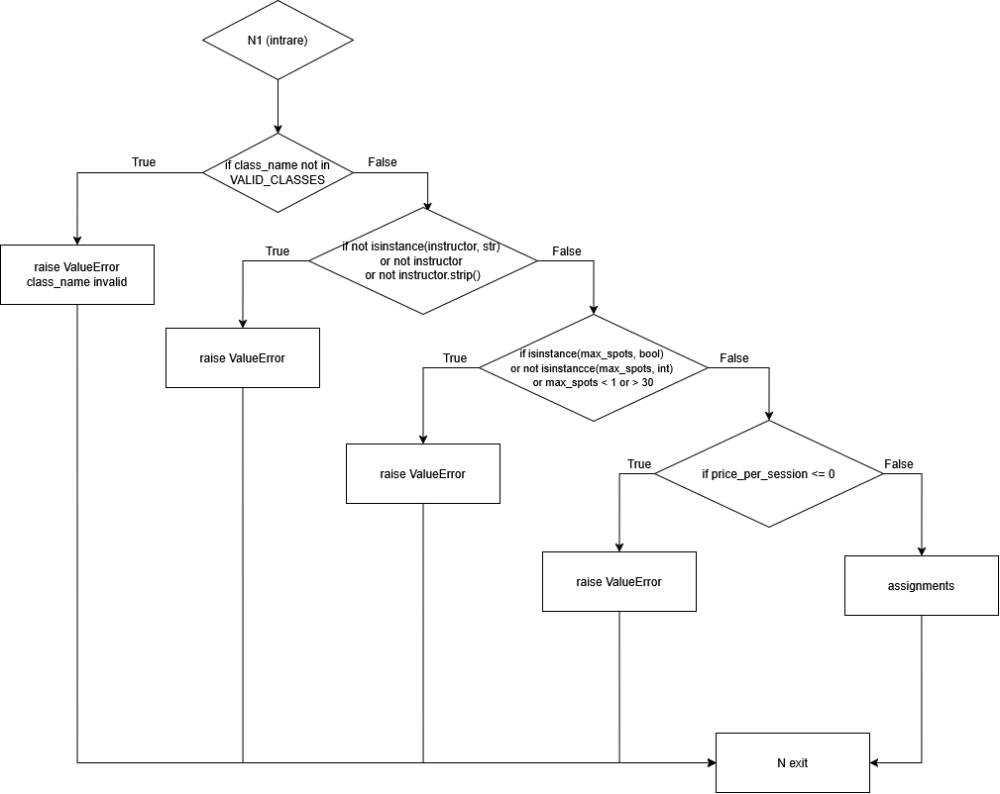
</p>

#### `book_spot`
<p align="center">
  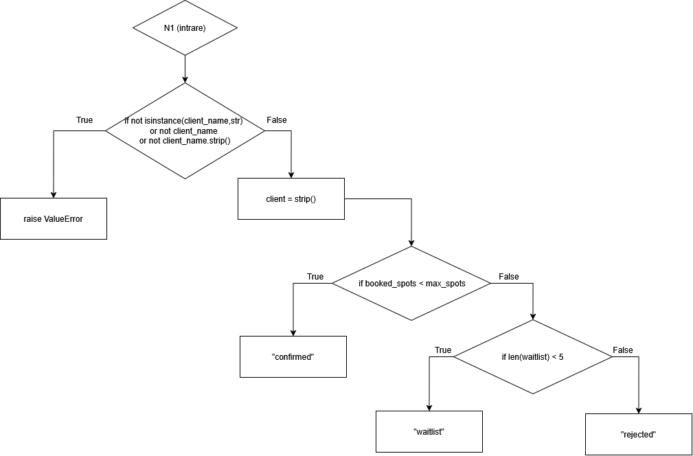
</p>

#### `cancel_booking`
<p align="center">
  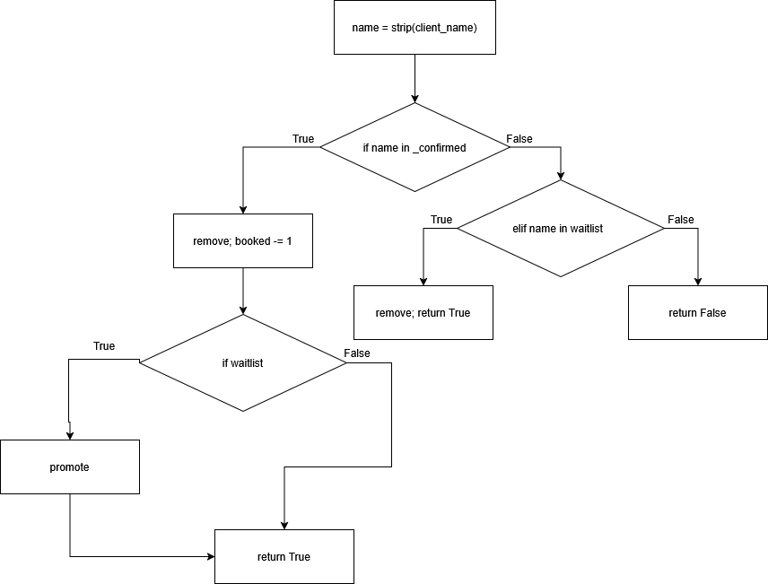
</p>

#### `calculate_cost`
<p align="center">
  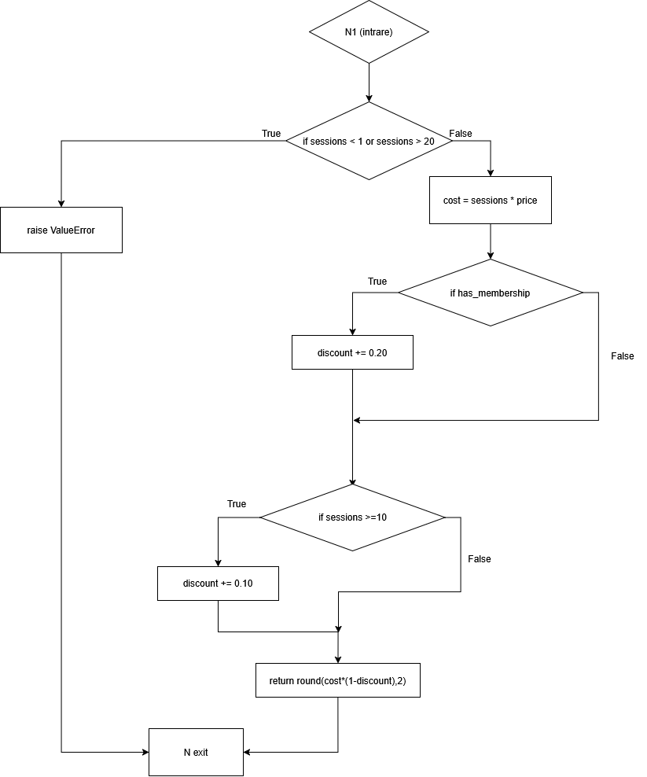
</p>

---

## 7. Raport mutmut – analiză reală

**Comandă:** `mutmut run --paths-to-mutate fitness_class_booking.py --tests-dir . --runner "python -m pytest"`  
**Mediu:** WSL Ubuntu 24.04.1 LTS / Python 3.12.3 / mutmut 2.5.1

| Categorie | Număr |
|-----------|-------|
| Total mutanți generați | 86 |
| Uciși | 65 |
| Suspicioși | 13 |
| Supraviețuitori | 8 |
| Scor inițial | 65/86 ≈ 75.6% |

### Clasificarea mutanților supraviețuitori (8)

| Grup | Mutanți | Tip | Acțiune |
|------|---------|-----|---------|
| Grup A – Mutanți de text / mesaj | M9, M14, M21, M26, M39, M70 | Modifică doar mesajele `ValueError` adăugând prefix/sufix `"XX"` — excepția este în continuare aruncată | Documentați, nu omorâți |
| Grup B – Quasi-echivalent | M49 | `cancel_booking`: diferență observabilă doar dacă există un client cu numele exact `"XXXX"` și se apelează `cancel_booking(None)` | Documentat |
| Grup C – Comportamental neechivalent | M75 | Modifică logica de business; produce bug real | Omorât prin teste suplimentare |

**Scor final (mutanți comportamentali neechivalenți): 1/1 = 100%**

### Tabel detaliat mutanți comportamentali

| Mutant | Original | Modificare mutmut | Efect bug | Test care îl omoară |
|--------|----------|--------------------|-----------|---------------------|
| M75 | `round(cost, 2)` | `2` → `3` | Costul returnat cu 3 zecimale în loc de 2 | `test_kill_M76_cost_rounds_to_two_decimal_places` |

---

## 8. Configurație hardware și software

### Laptopuri folosite

| Model | Procesor | Memorie | Stocare |
|-------|----------|---------|---------|
| HP Victus 16 | Intel Core i7-12700H | 16 GB RAM DDR5 4800 MHz (SK hynix) | 512 GB SSD (Samsung) |
| HP Laptop 15 | Intel Core i7-1165G7 | 16 GB RAM DDR4 2933 MHz | 512 GB SSD (Micron OEM) |

### OS și mediu de lucru

| Componentă | Versiune / detalii |
|-----------|--------------------|
| Windows | Windows 11 25H2, build 26200.8246 |
| WSL | 2.6.3.0 |
| Kernel WSL | 6.6.87.2-microsoft-standard-WSL2 |
| Distro Linux | Ubuntu 24.04.1 LTS (Noble Numbat) |
| VS Code | 1.116.0 |
| Python în WSL | 3.12.3 |
| pip în WSL | 24.0 |
| pytest în WSL | 9.0.2 |
| coverage.py în WSL | 7.13.5 |
| mutmut în WSL | 2.5.1 |

Versiunile de mai sus au fost preluate local din PowerShell și din venv-ul WSL
`/home/alex/tss_venv`.

Nu a fost folosită o mașină virtuală clasică; mediul Linux a fost accesat prin
WSL2.

## 9. Cum se rulează

Comenzile de mai jos urmează documentația oficială pentru pytest [1],
coverage.py [2] și mutmut [3].

> **Rulare rapidă (recomandat):** scriptul `run_coverage.sh` execută automat toți pașii de mai jos (instalare, teste, coverage, mutmut). Se rulează din WSL cu venv-ul activat:
> ```bash
> bash run_coverage.sh
> ```

### Pregătire mediu (WSL + venv)

```bash
# Creare și activare virtual environment
python3 -m venv tss_venv
source tss_venv/bin/activate

# Instalare dependențe
pip install pytest coverage "mutmut<3"

# Navigare la proiect
cd <path_catre_TSS_Proiect>  # ex: /mnt/c/Users/alexn/Documents/GitHub/TSS_Proiect
```

### Teste unitare (pytest)

```bash
# Rulare toate testele cu output verbose
python -m pytest test_*.py -v
```

### Coverage (instrucțiuni + ramuri)

```bash
# Rulare suite cu colectare coverage
python -m coverage run --branch -m pytest test_*.py

# Raport în consolă (afișează liniile/ramurile neacoperite)
python -m coverage report -m --include="fitness_class_booking.py"

# Raport HTML (deschide htmlcov/index.html în browser)
python -m coverage html --include="fitness_class_booking.py"
```

### Analiză mutanți (mutmut)

```bash
# Creare symlink python dacă lipsește (doar dacă mutmut nu găsește interpretorul)
ln -sf /usr/bin/python3 /usr/local/bin/python

# Rulare analiză mutanți
mutmut run --paths-to-mutate fitness_class_booking.py \
           --tests-dir . \
           --runner "python -m pytest"

# Vizualizare rezultate sumar
mutmut results

# Inspectare mutant individual (înlocuiește <ID> cu numărul mutantului)
mutmut show <ID>
```


### Capturi de ecran

Mai jos sunt capturile reale, in ordinea comenzilor rulate.

**1-2. `python -m pytest test_*.py -v`**

<p align="center">
  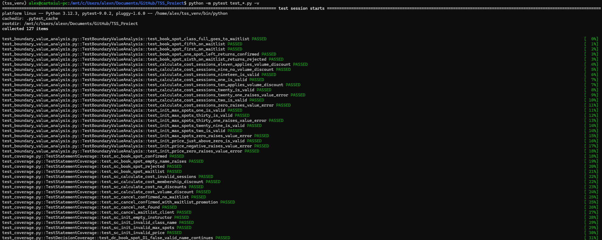
</p>

<p align="center">
  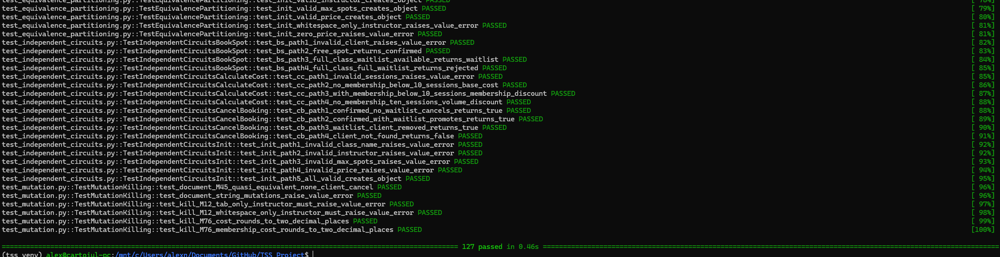
</p>

**3. `python -m coverage run --branch -m pytest test_*.py`**

<p align="center">
  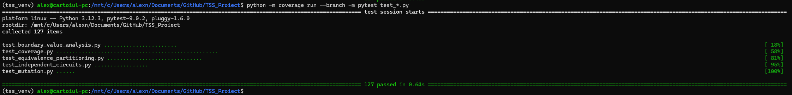
</p>

**4. `python -m coverage report -m --include="fitness_class_booking.py"`**

<p align="center">
  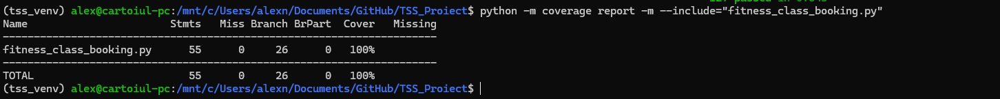
</p>

**5. `mutmut run --paths-to-mutate fitness_class_booking.py --tests-dir . --runner "python -m pytest"` + `mutmut results`**

<p align="center">
  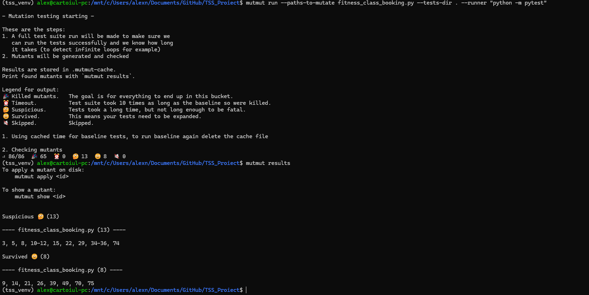
</p>

**6. Mutanți supraviețuitori, partea 1**

<p align="center">
  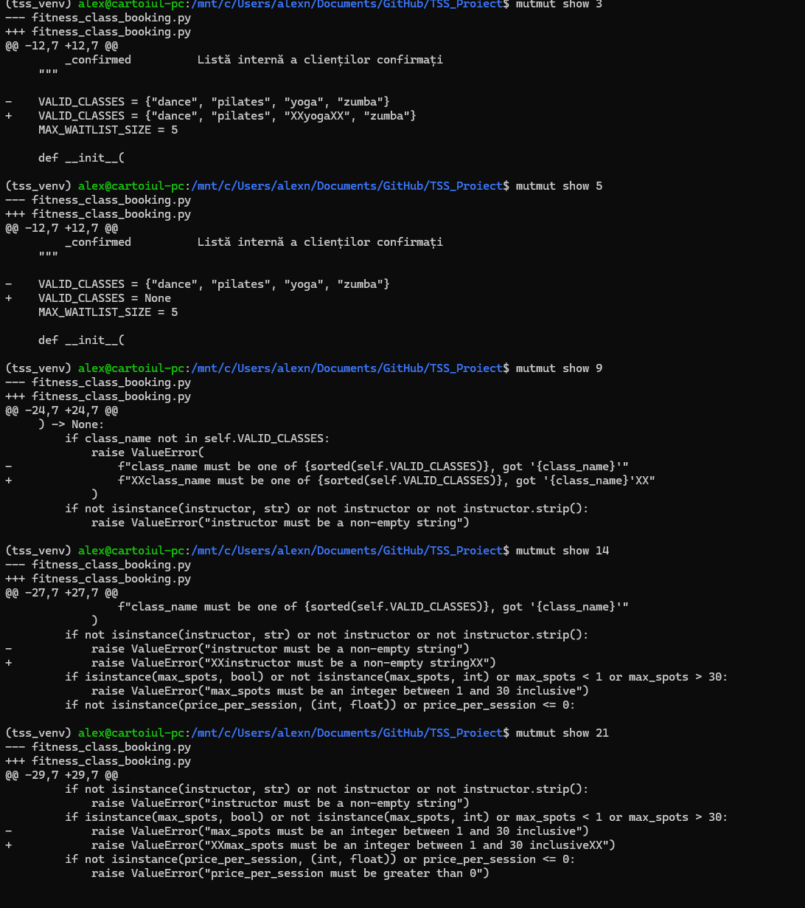
</p>

**7. Mutanți supraviețuitori, partea 2**

<p align="center">
  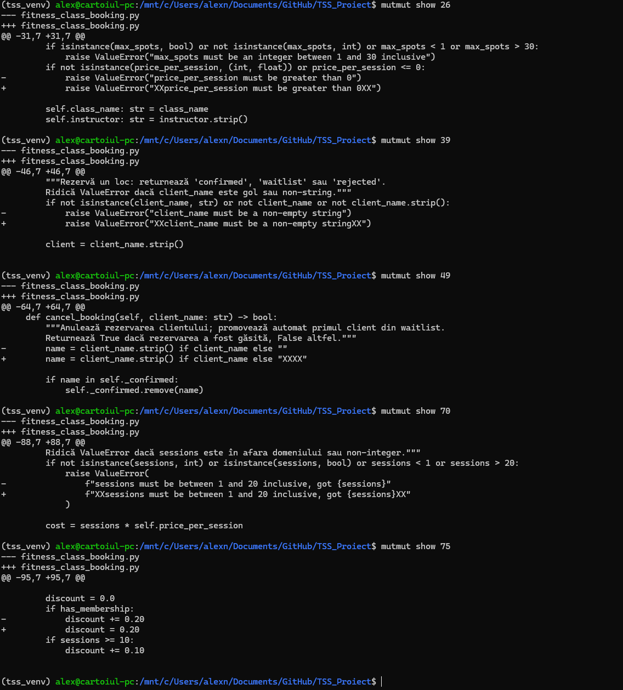
</p>

**8. Rulare fragment Python din WSL**

<p align="center">
  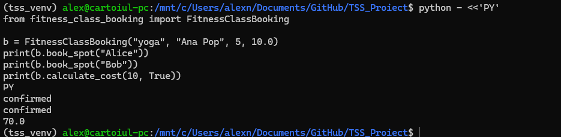
</p>

---

## 10. Structura proiectului

```
TSS_Proiect/
├── fitness_class_booking.py               # Clasa de testat (4 metode: __init__ + 3 instance methods)
├── test_equivalence_partitioning.py       # Strategia 1: clase de echivalență (EC01–EC30)
├── test_boundary_value_analysis.py        # Strategia 2: valori de frontieră (BVA01–BVA23)
├── test_coverage.py                       # Strategiile 3–5: instrucțiune / decizie / condiție
├── test_independent_circuits.py           # Strategia 6: basis path testing (McCabe)
├── test_mutation.py                       # Strategiile 7–8: raport mutmut + teste suplimentare
├── run_coverage.sh                        # Script de rulare complet (bash/WSL)
├── init_cfg.drawio.png                    # CFG __init__ (export PNG)
├── init_cfg.drawio.svg                    # CFG __init__ (export SVG)
├── book_spot_cfg.drawio.png               # CFG book_spot (export PNG)
├── book_spot_cfg.drawio.svg               # CFG book_spot (export SVG)
├── cancel_booking_cfg.drawio.png          # CFG cancel_booking (export PNG)
├── cancel_booking_cfg.drawio.svg          # CFG cancel_booking (export SVG)
├── calculate_cost_cfg.drawio.png          # CFG calculate_cost (export PNG)
├── calculate_cost_cfg.drawio.svg          # CFG calculate_cost (export SVG)
├── raport_ai.docx                         # Raport comparativ teste AI
├── raport_ai.txt                          # Raport comparativ teste AI (text)
├── screenshots/                           # Capturi de ecran comenzi rulate (12 fișiere)
├── teste_ai/                              # Suite de teste generate de AI (pentru comparație)
│   ├── fitness_class_booking.py           # Copie a clasei pentru izolarea testelor AI
│   ├── test_ai_equivalence_partitioning.py
│   ├── test_ai_boundary_value_analysis.py
│   ├── test_ai_coverage.py
│   ├── test_ai_independent_circuits.py
│   ├── test_ai_mutation.py
│   └── __init__.py
└── README.md                              
```

**Total teste (suite principală): 127 | Toate trec (0 eșuate)**

---

## 11. Referințe & Documentații

### Linkuri

- [pytest - official documentation][1]
- [coverage.py - official documentation][2]
- [mutmut - official documentation][3]
- [draw.io / diagrams.net - official website](https://www.diagrams.net/)
- [unittest - Python standard library documentation](https://docs.python.org/3/library/unittest.html)
- [VS Code - documentation](https://code.visualstudio.com/docs)
- [Windows Subsystem for Linux - documentation](https://learn.microsoft.com/windows/wsl/)


[1]: https://docs.pytest.org/
[2]: https://coverage.readthedocs.io/
[3]: https://mutmut.readthedocs.io/en/

